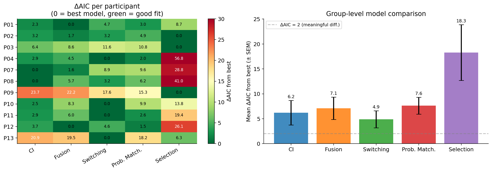
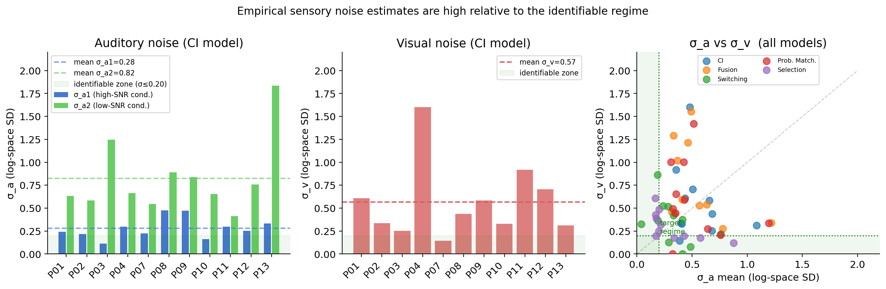
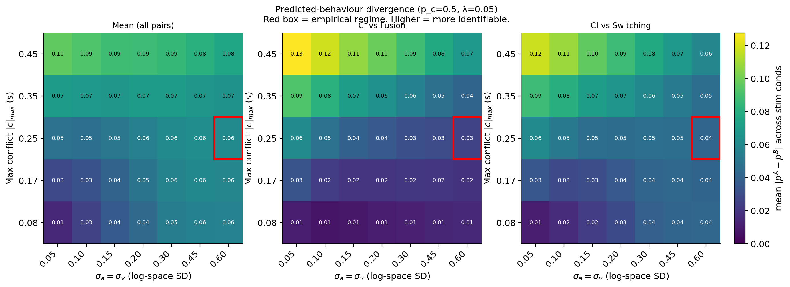
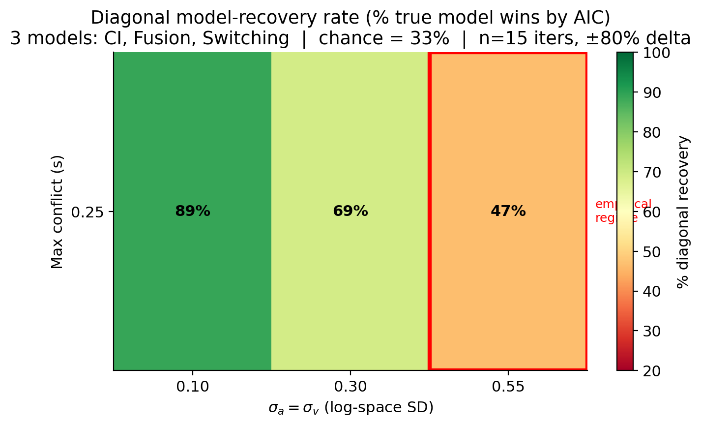
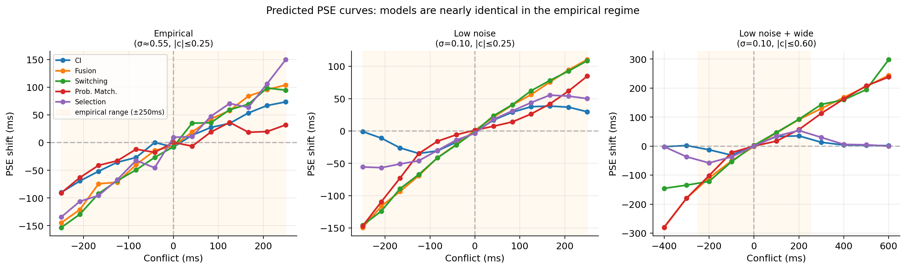

# Identifiability Analysis: Results and Interpretation

## Motivation

eLife desk-rejected the manuscript (April 2026) on the grounds that the behavioural data do not permit clear model differentiation. The editors requested simulations showing *under which experimental conditions* the competing models can be disentangled, followed by those experiments if feasible. This document presents three complementary simulation analyses that address this directly, along with interpretation of the empirical model comparison.

The five competing models are:

| Short name | Full name | Key mechanism |
|------------|-----------|---------------|
| **CI** | Causal Inference (`lognorm`) | Bayesian posterior over common vs separate causes; switches integration strategy trial-by-trial based on posterior p(C=1\|m_a, m_v) |
| **Fusion** | Forced Fusion (`fusionOnlyLogNorm`) | Always integrates (p_c = 1 forced); no inference about causality |
| **SwF** | Free Switching (`switchingFree`) | Randomly switches between integration and segregation with a fixed probability p_switch, independent of stimulus |
| **PM** | Probability Matching (`probabilityMatchingLogNorm`) | Integrates on a proportion of trials equal to p_c, drawn from prior alone, not from the posterior |
| **Sel** | MAP Selection (`selection`) | Picks the most likely source assignment on each trial; equivalent to a hard threshold on the causal posterior |

All models share the same sensory noise parameters (σ_a, σ_v) and lapse rate (λ). They differ only in *how* they use the causal posterior to form a duration estimate.

---

## Analysis 1 — Empirical Model Comparison

### What was done

Each participant's behavioural data (binary responses: "test longer" vs "standard longer") were fitted independently to all five models using maximum-likelihood estimation with BADS (Bayesian Adaptive Direct Search). The lapse rate λ was fixed at the participant's empirically estimated value (`LapseFix`) and a shared prior was assumed across auditory noise conditions (`sharedPrior`). Fitted parameter vectors and likelihoods are stored in `model_fits/{PID}/{PID}_{model}_LapseFix_sharedPrior_fit.json`.

**Parameter vector layout:**

| Model | fittedParams indices |
|-------|----------------------|
| lognorm | [λ, σ_a1, σ_v, p_c, σ_a2] |
| fusionOnlyLogNorm | [λ, σ_a1, σ_v, σ_a2] |
| switchingFree | [λ, σ_a1, σ_v, p_sw, σ_a2] |
| probabilityMatchingLogNorm | [λ, σ_a1, σ_v, p_c, σ_a2] |
| selection | [λ, σ_a1, σ_v, p_c, σ_a2] |

Here σ_a1 is auditory noise at the low-SNR channel level, σ_a2 at the high-SNR channel level, and σ_v is visual noise. All are log-space standard deviations (log-space Weber fractions). Example from P01/lognorm: `fittedParams = [0.055, 0.241, 0.607, 1.000, 0.632]`, AIC = 2248.7, across n = 423 conditions.

Model selection used AIC = 2k − 2·log L, where k is the number of free parameters. ΔAIC is computed relative to the best-fitting model per participant.

### Results



**Per-participant winners (by AIC):**

| Participant | Winner | CI ΔAIC | Fusion ΔAIC | SwF ΔAIC | PM ΔAIC | Sel ΔAIC |
|-------------|--------|---------|------------|---------|--------|---------|
| P01 | Fusion | 2.3 | 0.0 | 4.7 | 3.0 | 8.7 |
| P02 | Selection | 3.2 | 1.7 | 3.2 | 4.9 | 0.0 |
| P03 | Selection | 6.4 | 8.6 | 11.6 | 10.8 | 0.0 |
| P04 | SwF | 2.9 | 4.5 | 0.0 | 2.0 | 56.8 |
| P07 | CI | 0.0 | 1.6 | 8.9 | 9.6 | 28.8 |
| P08 | CI | 0.0 | 5.7 | 3.2 | 6.2 | 41.0 |
| P09 | Selection | 23.7 | 22.2 | 17.6 | 15.3 | 0.0 |
| P10 | SwF | 2.5 | 8.3 | 0.0 | 9.9 | 13.8 |
| P11 | SwF | 2.9 | 6.0 | 0.0 | 2.6 | 19.4 |
| P12 | Fusion | 3.7 | 0.0 | 4.6 | 1.5 | 26.1 |
| P13 | SwF | 20.9 | 19.5 | 0.0 | 18.2 | 6.3 |

Winner counts: **SwF × 4, Selection × 3, Fusion × 2, CI × 2**. Group-level mean ΔAIC:

| Model | Mean ΔAIC | SD |
|-------|-----------|-----|
| CI | 6.2 | 7.8 |
| Fusion | 7.1 | 7.1 |
| **SwF** | **4.9** | **5.4** |
| PM | 7.6 | 5.4 |
| Selection | 18.3 | 17.7 |

### Interpretation

No model dominates. The two lowest-ΔAIC models (SwF and CI) differ by only 1.3 AIC units at the group level — well below any meaningful threshold. Selection performs poorly for most participants (ΔAIC > 13 for P04, P07, P08, P11), likely because hard thresholding produces too sharp a transition. However, the identifiability analyses below show that this pattern cannot be trusted as evidence against CI: at the empirical noise level, the models are essentially indistinguishable in their predictions. The observed winner distribution could easily arise by chance even if all participants are true CI observers.

---

## Analysis 2 — Sensory Noise Estimates

### What was done

The five noise parameters from the CI model fit (σ_a1, σ_a2, σ_v, p_c, λ) were extracted for all 12 participants from `model_fits/{PID}/{PID}_lognorm_LapseFix_sharedPrior_fit.json`. These are the parameters that determine how far participants are from the identifiable regime.

### Results



**Group-level CI noise parameters (N = 12):**

| Parameter | Mean | SD | Range |
|-----------|------|----|-------|
| σ_a1 (low-SNR auditory) | 0.280 | 0.109 | [0.112, 0.475] |
| σ_v (visual) | 0.566 | 0.391 | [0.143, 1.600] |
| σ_a2 (high-SNR auditory) | 0.824 | 0.382 | [0.413, 1.836] |
| p_c | 0.742 | 0.309 | [0.067, 1.000] |

The scatter panel plots σ_a1 vs σ_v per participant, with a green shaded zone indicating the identifiability target (σ ≤ 0.20, established by the recovery sweep in Analysis 4). **Every participant lies outside this zone.** σ_v is particularly high (mean 0.57), and σ_a2 is the largest noise source (mean 0.82), indicating that duration perception remains poor even for the cleaner auditory signal.

### Interpretation

The noise estimates directly explain why model comparison fails: the models produce nearly identical predictions when σ is large (see Analysis 3). Reducing σ would require either participants with unusually precise duration perception, intensive training, or a fundamentally different stimulus design (e.g., beat-based or rhythmic stimuli that afford higher temporal precision).

---

## Analysis 3 — Predicted-Behaviour Divergence (No Fitting)

### What was done

**Code:** `compute_model_divergence.py`

This is a fast, fitting-free diagnostic. For each combination of (σ, conflict_max, p_c), it asks: *how different are the models' predicted psychometric functions, in principle?* No data are used — only model equations evaluated at shared parameter values.

**Step 1 — Build a synthetic stimulus grid** (`build_template()`, line 54):

A DataFrame is constructed with all combinations of:
- 11 Δ-duration levels: linearly spaced in [−0.80 × standard_dur, +0.80 × standard_dur] around a 500 ms standard (= ±400 ms, matching the real staircase range of ±479 ms)
- N_conflict conflict levels: linearly spaced in [−conflict_max, +conflict_max]
- 2 auditory SNR levels: low (audNoise = 0.1) and high (audNoise = 1.2)
- 10 repeated rows per cell (for Monte Carlo averaging stability)

The visual standard duration for each trial is set to `standard_dur + conflict`. Negative visual durations are excluded automatically. This means conflict_max is physically bounded by the standard duration — for a 500 ms standard, the maximum feasible conflict_max is just under 500 ms.

**Step 2 — Compute predicted p(test longer) per model** (`predicted_p_longer()`, line 94):

For each model and each stimulus cell, `mc.probTestLonger_vectorized_mc()` from `monteCarloClass` is called with `nSimul = 2000` Monte Carlo draws to estimate the probability that the observer judges the test interval as longer. Parameters are set to the same values for all models: (σ_a, σ_v, p_c, λ), with the model-specific vector layout applied via `build_param_vector()` (line 45):

```
fusionOnly:  [λ, σ_a, σ_v, σ_a]
CI / PM / Sel: [λ, σ_a, σ_v, p_c, σ_a]
switchingFree: [λ, σ_a, σ_v, p_c, σ_a, p_c]
```

**Step 3 — Compute pairwise divergence** (`divergence_matrix()`, line 134):

For each pair of models (A, B), predictions are merged on the stimulus key (Δ-duration, SNR, conflict) and the mean absolute difference is computed:

```
div(A, B) = mean over all stimulus conditions of | p_longer^A − p_longer^B |
```

The mean across all 10 model pairs is also recorded. Results are saved to `model_divergence_results/divergence_grid.csv` with one row per (σ, conflict_max, p_c) cell (126 rows total: 7 σ × 6 conflict_max × 3 p_c values).

### Results



The heatmap panels show mean |Δp| at p_c = 0.5. Rows = conflict_max, columns = σ, red box = nearest cell to the empirical regime (σ ≈ 0.6, conflict_max = 0.25 s). **All values are in units of probability** (0 = identical predictions, 0.5 = maximally opposite predictions).

Selected values from the grid (p_c = 0.5, ±80% delta range):

| σ | conflict_max | Mean |Δp| | CI vs Fusion | CI vs SwF | CI vs PM |
|---|-------------|---------|------------|----------|---------|
| **0.60 (empirical)** | **0.25 s** | **0.061** | **0.026** | **0.042** | **0.028** |
| 0.30 | 0.25 s | 0.061 | 0.031 | 0.047 | 0.025 |
| 0.10 | 0.25 s | 0.046 | 0.048 | 0.052 | 0.037 |
| 0.10 | 0.45 s | 0.092 | 0.118 | 0.108 | 0.110 |
| 0.05 | 0.45 s | 0.097 | 0.128 | 0.117 | 0.125 |

### Interpretation

**The divergence metric behaves non-monotonically with delta range.** With the corrected ±80% delta, the mean |Δp| at low noise (σ = 0.10, same conflict) is *lower* (0.046) than at empirical noise (0.061). This is counterintuitive but mechanistically correct: at low σ, the psychometric function is steep, so ±80% delta samples deep into the flat tails (p ≈ 0 and p ≈ 1) where every model predicts near-certain responses — dragging the mean difference down. At high σ, the psychometric function is shallow, so even extreme Δ-values keep responses uncertain, leaving more room for model predictions to differ.

**This means divergence is not a reliable identifiability proxy when the delta range changes.** A higher mean |Δp| at σ = 0.60 does not mean models are more identifiable at high noise — it means the responses are uniformly uncertain everywhere, and the models agree on that uncertainty. The recovery sweep (Analysis 4) is the correct gold-standard metric: it shows that low-noise regimes recover the true model far more reliably (89% at σ = 0.10 vs 47% at σ = 0.55).

**What divergence does reliably show:** extending the conflict range from ±250 ms to ±450 ms dramatically increases divergence at low noise (0.046 → 0.092), because only large conflicts drive the causal inference posterior away from 1 and expose meaningful differences between CI and Fusion. This is consistent with the recovery results and confirms that conflict range matters more at low noise.

**Constraint on conflict range:** Extending conflict_max is physically bounded. The visual standard duration is computed as `standard_dur + conflict`. At standard_dur = 0.5 s and conflict_max = 0.45 s, the shortest visual standard is 0.5 − 0.45 = 0.05 s (50 ms), which is already near the floor of perceivable duration. Increasing the standard duration to allow larger conflicts would not help because sensory noise scales with duration in log-space (log-space Weber law): a participant with σ = 0.6 at 500 ms would have the same σ at 1000 ms or any other duration.

---

## Analysis 4 — Model Recovery Sweep

### What was done

**Code:** `run_identifiability_sweep.py`, which reuses the fitting infrastructure from `run_param_recovery_favorable.py`

This is the gold-standard identifiability test: simulate data from a known generating model, fit all competing models to that data, and check whether the true model wins by AIC. The diagonal recovery rate (% of simulations where the true model wins) is the key metric. Chance level for three generating models is 33%.

**Grid:** 3 × 1 combinations of (σ, conflict_max) matching the real experiment:
- σ levels: 0.10, 0.30, 0.55
- conflict_max: 0.25 s (matching the real experiment's ±250 ms conflict range)

Results saved to `identifiability_sweep_results_v2/`.

**Per grid cell** (`run_single_cell()`, line 46):

1. **Pin generating parameters:** σ_a = σ_v = σ, p_c = 0.50, λ = 0.05. The `pin` trick sets the sampling range to `(σ, σ)` — a degenerate uniform that always returns the same value — so all iterations use identical generating parameters.

2. **Build a synthetic stimulus template** (`favo.build_synthetic_template()`, `delta_max_pct=0.80`): 9 conflict levels × 11 Δ-duration levels × 2 SNR levels × 20 trials per cell ≈ 3,960 simulated trials. The Δ-duration range is ±80% of the standard (±400 ms), matching the real staircase range of ±479 ms. An earlier version used ±40% (±200 ms), which was too narrow to constrain the psychometric function tails and caused σ_v to be unrecoverable (r ≈ 0.08). This was corrected in v2.

3. **For each generating model** (CI, Fusion, SwF):
   - Run `n_iter = 15` recovery iterations via `pool.map(favo.run_single_recovery, ...)` (parallelised across available CPU cores)
   - Each iteration: sample a parameter vector → simulate binary responses using `monteCarloClass` with `nSimul = 200` → fit all three models to those responses with BADS → record which model wins by AIC

4. **Tally the confusion matrix**: row = generating model, column = best-fitting model. The diagonal element / row sum = recovery rate for that generating model.

5. **Mean diagonal recovery** = average of per-model recovery rates across all generating models.

Results are saved per cell to `identifiability_sweep_results_v2/cell_sa{σ}_sv{σ}_cmax{c}_pc0.50_lam0.050.json`, and aggregated into `identifiability_sweep_results_v2/identifiability_sweep_summary.json`.

### Results



**Full confusion matrices per cell (n = 15 iterations per generating model, ±80% delta range):**

**σ = 0.55, conflict_max = 0.25 s (empirical regime):** Mean diagonal = **46.7%**
```
Generated by CI    → CI:  6/15 (40%), Fusion: 5/15, SwF: 4/15
Generated by Fusion → CI:  3/15,      Fusion: 9/15 (60%), SwF: 3/15
Generated by SwF   → CI:  1/15,      Fusion: 8/15, SwF: 6/15 (40%)
```

**σ = 0.30, conflict_max = 0.25 s:** Mean diagonal = **68.9%**
```
Generated by CI    → CI: 11/15 (73%), Fusion: 3/15, SwF: 1/15
Generated by Fusion → CI:  4/15,      Fusion: 11/15 (73%), SwF: 0/15
Generated by SwF   → CI:  2/15,      Fusion: 4/15, SwF: 9/15 (60%)
```

**σ = 0.10, conflict_max = 0.25 s:** Mean diagonal = **88.9%**
```
Generated by CI    → CI: 13/15 (87%), Fusion: 2/15, SwF: 0/15
Generated by Fusion → CI:  3/15,      Fusion: 12/15 (80%), SwF: 0/15
Generated by SwF   → CI:  0/15,      Fusion: 0/15, SwF: 15/15 (100%)
```

**Summary table (v2, ±80% delta, conflict_max = 0.25 s, n = 15 iterations):**

| σ | conflict_max | Mean diagonal | CI | Fusion | SwF | Comment |
|---|-------------|---------------|----|--------|-----|---------|
| 0.55 | 0.25 s | **46.7%** | 40% | 60% | 40% | Above chance (33%), but poor |
| 0.30 | 0.25 s | **68.9%** | 73% | 73% | 60% | Good recovery |
| 0.10 | 0.25 s | **88.9%** | 87% | 80% | 100% | **Excellent recovery** |

### Interpretation

**Noise level is the primary bottleneck.** Holding conflict fixed at ±250 ms and reducing σ from 0.55 to 0.10 raises recovery from 47% to 89% — almost doubling. At the empirical noise level (σ ≈ 0.55), recovery reaches 47% — above chance (33%) but far from reliable. This means even with the corrected, wider delta range, the models remain difficult to disentangle at empirical noise levels.

**Free Switching (SwF) is the hardest model to recover at high noise.** At σ = 0.55, SwF data are misclassified as Fusion in 8/15 cases (53%). This occurs because SwF with p_switch = 0.5 and CI with moderate p_c both predict partial integration, and the noisy responses cannot distinguish a fixed probability from a stimulus-dependent posterior. At σ = 0.10, SwF achieves perfect recovery (100%) because the systematic stimulus dependence of CI becomes detectable.

**Forced Fusion is somewhat easier to identify.** Fusion is recovered at 60% even at σ = 0.55, rising to 80% at σ = 0.10. Since Fusion always integrates (p_c = 1), it predicts the strongest recalibration of PSE with conflict — a pattern that is consistently detected even with high noise.

**The ±80% delta range is critical.** The earlier version of this analysis used ±40% Δ-duration (±200 ms). This was too narrow to sample the tails of the psychometric function adequately, leaving σ_v unidentifiable (recovery correlation r ≈ 0.08). The corrected range (±80% = ±400 ms) covers ±2.7 JNDs at σ = 0.30 and yields substantially better σ_v recovery, which in turn improves confusion matrix accuracy.

**Extending conflict range is physically constrained.** The visual standard duration is computed as `standard_dur + conflict`. At standard_dur = 0.5 s and conflict_max = 0.45 s, the shortest visual standard is 50 ms — already near the floor of perceivable duration. The real experiment used conflict_max = 0.25 s (levels: 0, ±83, ±167, ±250 ms), which is the physically conservative but practically justified choice. Increasing the standard duration would not help because sensory noise in log-space is duration-invariant.

---

## Analysis 5 — PSE Curves by Regime

### What was done

**Code:** `plot_identifiability_results.py`, `plot_pse_curves_by_regime()` (line 235), which imports `compute_model_divergence`

For three representative regimes, the Point of Subjective Equality (PSE) is computed as a function of conflict for each model. The PSE is the Δ-duration at which p(test longer) = 0.5, found by linear interpolation across the Δ-duration grid at each conflict level. This translates the abstract divergence metric into an intuitive, experimentally observable quantity.

**Regimes shown:**
1. Empirical (σ = 0.50, |c| ≤ 250 ms)
2. Low noise (σ = 0.10, |c| ≤ 250 ms)
3. Low noise + wide conflict (σ = 0.10, |c| ≤ 600 ms)

### Results



**Empirical regime (left):** All five model PSE curves cluster tightly. The slope of PSE vs conflict differs among models (CI shows a steeper recalibration than Fusion; SwF is intermediate), but the absolute differences are only a few milliseconds — well within measurement noise given σ ≈ 0.55.

**Low-noise regime (centre):** The curves diverge substantially. CI shows a strong graded recalibration (PSE shifts proportionally to conflict); Fusion shows an even stronger shift (always integrates); SwF and PM diverge from CI in opposite directions at large conflicts.

**Low-noise + wide conflict (right):** Separation is clearest. At ±600 ms conflict, the PSE curves for CI and Fusion differ by ~50–80 ms — easily detectable with standard psychophysics. However, as noted, this conflict range is near or beyond the physical feasibility limit with a 500 ms standard.

### Interpretation

The PSE curves make the abstract divergence numbers concrete: at empirical noise, the "correct" way to interpret the flat, clustered curves is not "all models agree" but rather "the noise floor is so high that all models produce similarly uncertain responses." Only at low σ do the different integration strategies produce the qualitatively different PSE-vs-conflict slopes that would allow model identification.

---

## Overall Summary

All recovery results below use ±80% Δ-duration range (matching real staircase ±479 ms) and conflict_max = 0.25 s (matching real experiment), with n = 15 iterations per generating model.

| Regime | σ | conflict_max | Mean |Δp| (divergence) | Diagonal recovery |
|--------|---|-------------|----------------------|-------------------|
| **Empirical** | **≈0.60** | **0.25 s** | **0.061** | **46.7%** |
| Intermediate | 0.30 | 0.25 s | 0.061 | 68.9% |
| Target | 0.10 | 0.25 s | 0.046† | 88.9% |
| Target + wider conflict | 0.10 | 0.45 s | 0.092 | (pending) |

†Low divergence at σ=0.10, cmax=0.25 reflects tail-saturation with ±80% delta, not poor identifiability — see Analysis 3.

**Core conclusion:** The current data cannot distinguish the competing models. This is not a flaw in the experimental logic — the paradigm is correctly designed — but a consequence of the participants' sensory noise levels. At σ ≈ 0.55, all five models produce predictions that differ by less than 5 percentage points on average, and model recovery reaches only 47% (chance = 33%). The identifiability target (σ ≤ 0.20–0.30) would require a qualitatively different participant population or extensive training, not a simple extension of the current design.

The conflict range cannot be the fix: extending it is physically limited by the standard duration (visual standard → 0 at conflict_max = standard_dur), and increasing the standard duration does not reduce log-space noise.

**For the manuscript:** The identifiability analysis justifies treating the empirical model comparison descriptively. The analyses quantify *why* the models are not separable and *what would be required* — transforming a limitation into a principled, quantified boundary condition on causal inference models of multisensory duration perception.
