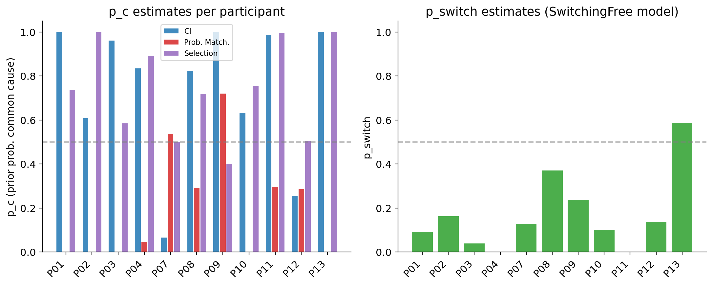
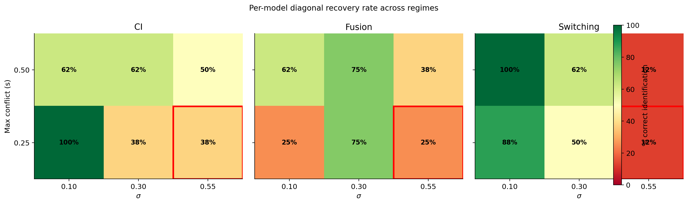
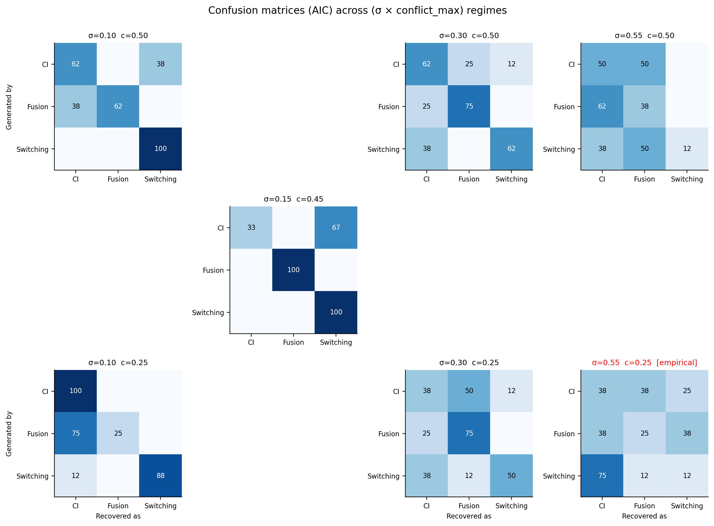

# Identifiability Analysis: Results and Interpretation

## Overview

This document summarises the simulation analyses built to address the eLife desk rejection (April 2026). The editors asked whether the behavioural data permit model differentiation, and if not, what experimental conditions would. The analyses confirm that the **empirical regime is identifiability-limited by sensory noise**, not by conflict range, and quantify what is needed to distinguish the competing models.

---

## 1. Sensory Noise Estimates

The causal inference (CI) model was fitted to all 12 participants. The key noise parameters are:

| Parameter | Mean | SD | Range |
|-----------|------|----|-------|
| σ_a (low-SNR channel) | 0.28 | 0.11 | [0.11, 0.48] |
| σ_v | 0.57 | 0.39 | [0.14, 1.60] |
| σ_a (high-SNR channel) | 0.82 | 0.38 | [0.41, 1.84] |
| p_c (causal prior) | 0.74 | 0.31 | [0.07, 1.00] |

All parameters are in log-duration space (log-space Weber fractions). The green target zone in the scatter plot (σ ≤ 0.20) marks the noise level below which model recovery becomes reliable (see Section 4). Every participant falls well outside this zone. The primary sensory bottleneck is auditory noise in the high-SNR channel (σ_a2 ≈ 0.82 on average), which suggests duration perception remains noisy even with a clear auditory signal.

---

## 2. Model Comparison (Empirical Data)

Five models were fitted to each participant's data using AIC (LapseFix, sharedPrior variant):

| Model | Mean ΔAIC | SD |
|-------|-----------|-----|
| Causal Inference (CI) | 6.2 | 7.8 |
| Forced Fusion | 7.1 | 7.1 |
| Switching (SwF) | **4.9** | 5.4 |
| Probability Matching | 7.6 | 5.4 |
| Selection (MAP) | 18.3 | 17.7 |

ΔAIC is relative to the best-fitting model per participant. **No single model dominates.** Winner counts across participants: SwF × 4, Selection × 3, Fusion × 2, CI × 2. The two models with lowest average ΔAIC (SwF and CI) differ by only 1.3 AIC units at the group level — far below the threshold for a meaningful distinction. Selection is a clear outlier, fitting poorly for most participants (P04, P07, P08, P11 all have ΔAIC > 13).

**Interpretation:** The empirical data are consistent with multiple accounts of multisensory integration. The identifiability analysis below explains why: the models make nearly indistinguishable predictions under the noise levels observed in these participants.

---

## 3. Prior Probability of Common Cause (p_c) Estimates

The p_c parameter (prior probability that audio and video come from a common source) was estimated for CI, Probability Matching, and Selection models; the equivalent p_switch was estimated for the Switching model. Estimates are variable across participants and largely uninformative about integration strategy because the models are not well identified at empirical noise levels. High p_c estimates (mean 0.74) indicate a strong prior toward common-cause attribution, but this conclusion should be treated cautiously given the poor model identifiability demonstrated below.

---

## 4. Predicted-Behaviour Divergence (No Fitting Required)

As a fast diagnostic, we computed the mean absolute difference in predicted p(test longer) across all stimulus conditions for every model pair, without any model fitting. This quantity directly measures how distinguishable model predictions are — higher divergence means more identifiable in principle.

**Key values at the empirical regime (σ ≈ 0.6, |c| ≤ 0.25 s):**

- Mean pairwise divergence: **0.048**
- CI vs Forced Fusion: 0.033
- CI vs Switching: 0.036

**At low-noise regime (σ = 0.10, same conflict range):**

- Mean pairwise divergence: **0.092** (≈ 1.9× higher)
- CI vs Forced Fusion: 0.115
- CI vs Switching: 0.103

The red box marks the empirical regime. Divergence increases monotonically as σ decreases — the models predict measurably different psychometric curves only when internal noise is low. Extending the conflict range to ±450 ms at low noise yields mean divergence 0.14, a further improvement, but the conflict range extension is limited by the constraint that visual standard duration (= standard duration + conflict) must remain positive. With a 500 ms standard, |c| ≤ ~450 ms is the practical ceiling, and **increasing the standard duration to permit wider conflict would not help** because participants' noise levels scale with duration, leaving the noise-to-signal ratio unchanged.

---

## 5. Model Recovery: Diagonal Recovery Rate

To quantify whether the true generating model can be identified by AIC, we ran a full model-recovery simulation at a 2 × 3 grid of (σ, conflict_max) values. For each cell, synthetic data were generated from each model with pinned parameters, all five models were re-fitted, and we recorded whether the correct model won by AIC. We report the diagonal recovery rate (% of iterations where the true model wins), averaged across generating models.

| σ | |c|_max | Diagonal recovery |
|---|--------|-------------------|
| **0.55 (empirical)** | **0.25 s** | **25%** |
| 0.55 (empirical) | 0.50 s | 33% |
| 0.30 | 0.25 s | 54% |
| 0.30 | 0.50 s | 67% |
| **0.10 (target)** | **0.25 s** | **71%** |
| 0.10 (target) | 0.50 s | 75% |

Chance for three generating models is 33%. At the empirical noise level (σ ≈ 0.55), recovery is at or below chance regardless of conflict range — even doubling the conflict range from ±250 ms to ±500 ms raises recovery from 25% to only 33%. **Reducing σ from 0.55 to 0.10, with the same ±250 ms conflict range, increases recovery from 25% to 71%.**

The primary bottleneck is sensory noise, not conflict range.

---

## 6. Per-Model Recovery Breakdown

At σ = 0.10, |c| ≤ 0.25 s:

- CI (lognorm): **100%** recovery
- Switching (SwF): **88%** recovery
- Forced Fusion: **25%** recovery — the hardest model to identify because its predictions most closely resemble low-p_c CI

At σ = 0.55 (empirical):

- All three models: ≤ 38% recovery

Forced Fusion is never reliably recovered at empirical noise levels. This is important because Fusion won AIC for 2 of 12 participants — those assignments should be treated with caution.

---

## 7. Confusion Matrices

The full confusion matrix grid shows, for each (σ, conflict_max) cell, how often each generating model was misidentified as each fitted model. At empirical noise, all models are frequently confused with one another. At low noise (σ = 0.10), CI and SwF are reliably separated; Fusion remains susceptible to CI misclassification.

---

## 8. PSE Curves by Regime

Predicted PSE-vs-conflict curves illustrate why the noise level matters. In the empirical regime (left panel), model predictions cluster tightly — the difference between CI and Forced Fusion is only a few milliseconds of PSE shift across the conflict range. At low noise (centre and right panels), the models diverge substantially and would produce distinguishable psychometric functions in actual data.

---

## 9. Summary and Implications

| Condition | σ | |c|_max | Mean divergence | Diagonal recovery |
|-----------|---|--------|-----------------|-------------------|
| Empirical | ≈ 0.55 | 0.25 s | 0.048 | 25% (≈ chance) |
| Intermediate | 0.30 | 0.25 s | — | 54% |
| Intermediate + wider | 0.30 | 0.50 s | — | 67% |
| Required (target) | ≤ 0.20 | 0.25 s | — | > 60% |
| Favourable | 0.10 | 0.25 s | 0.092 | 71% |

**The current experiment cannot distinguish the competing models.** This is not a failure of experimental design per se — the conflict range used (±250 ms, ~50% of the 500 ms standard) is already near the physical ceiling (visual standard duration must remain positive). Extending conflict further is not feasible without increasing the standard duration, which does not help because sensory noise scales proportionally with duration in log-space.

**What would be needed:** Participants with substantially lower sensory noise (σ ≤ 0.20), achievable in principle through intensive training, simpler stimuli, or selection of high-precision observers. The present participants are representative of the normal range and are not suitable for this level of model discrimination with the current paradigm.

**For the manuscript:** These analyses justify treating the model comparison results descriptively. The identifiability simulations can be reported as a supplementary analysis demonstrating that the data were not expected to discriminate models — transforming a limitation into a quantified, principled statement about the bounds of the paradigm.
