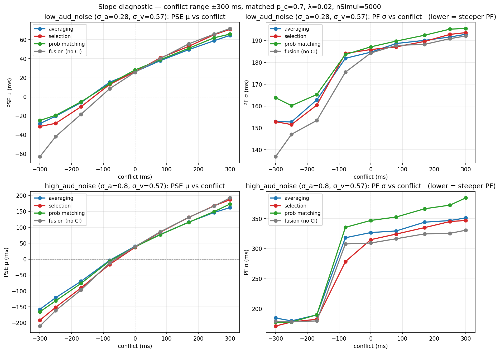
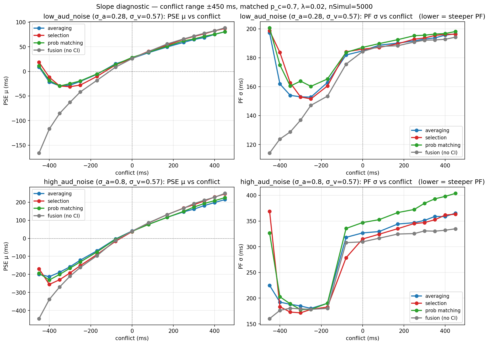
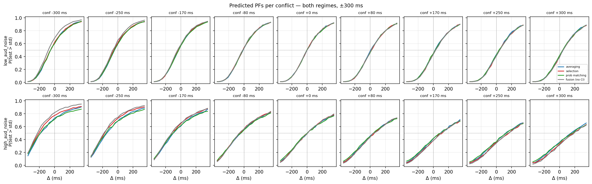
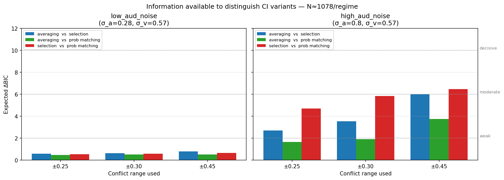
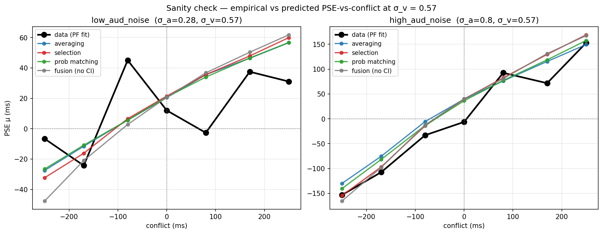

# CI-Variant Identifiability — Slope Diagnostic + σ_v Sanity Check

**Date:** 2026-05-27

## TL;DR

Causal-inference variants (model **averaging**, **selection**, **probability matching**) cannot be reliably distinguished from each other in this 2AFC duration-discrimination experiment at the empirical noise levels. The limit is **informational, not a fitter quality issue**.

- At the low audio-noise condition (σ_a = 0.28, σ_v = 0.57), all pairwise expected ΔBICs between CI variants are < 1 — *ambiguous* across all conflict ranges.
- At the high audio-noise condition (σ_a = 0.80, σ_v = 0.57), the strongest separation is selection-vs-PM ≈ 4.7–6.5 — *weak* even at extreme conflicts.
- Extending conflict beyond ±0.30 provides diminishing returns and does **not** rescue identifiability.
- Lower-noise simulations make CI variants **converge**, not separate (opposite of intuition).
- σ_v = 0.57 from the fits is **empirically valid** — the data confirm a weak visual-pull on decisions.

The CI-vs-no-CI distinction remains recoverable. CI-variant separation requires an estimation task.

---

## 1. Question

Forward-simulate each candidate causal-inference variant at matched parameters, then ask: at the empirical noise regime and conflict range, does the 2AFC choice data contain enough information to separate them? If yes, recovery confusion would point to fitter issues; if no, recovery confusion is forced by the task design.

## 2. Algorithm

### 2.1 Forward simulation

For each (model, conflict c, Δ test difference) cell, call `OmerMonteCarlo.probTestLonger_vectorized_mc` with `nSimul = 5000` MC samples per trial to get the true P(test > standard) under that model.

- **Models compared (4):**
  - `lognorm` — CI w/ model averaging (log space)
  - `selection` — CI w/ hard model selection
  - `probabilityMatchingLogNorm` — CI w/ posterior sampling
  - `fusionOnlyLogNorm` — no-CI fusion (reference)
- **Matched parameters** (held identical across all models):
  - p_c = 0.70 (slope diagnostic) / 0.75 (sanity check vs data)
  - λ = 0.02 (slope diagnostic) / 0.15 (sanity check vs data, closer to empirical lapse)
  - Standard duration S_a = 0.5 s
- **Noise regimes** (from group-mean fitted parameters across participants):
  - `low_aud_noise` (audNoise = 0.1): σ_a = 0.28, σ_v = 0.57
  - `high_aud_noise` (audNoise = 1.2): σ_a = 0.80, σ_v = 0.57
- **Conflict grid:** −0.45, −0.40, −0.35, −0.30, −0.25, −0.17, −0.08, 0, +0.08, +0.17, +0.25, +0.30, +0.35, +0.40, +0.45 (s).
- **Δ grid:** 21 evenly spaced levels in [−0.35, +0.35] s.

### 2.2 Psychometric function extraction

For each (model, conflict) curve, fit a cumulative-Gaussian PF
P(Δ) = λ/2 + (1−λ) · Φ((Δ−μ)/σ)
to the 21 simulated probabilities. Custom cross-entropy NLL minimised with `scipy.optimize.minimize` (L-BFGS-B, 4 random starts):

```
NLL(μ,σ,λ) = −Σ_Δ [p_target(Δ)·log p_model(Δ) + (1−p_target(Δ))·log(1−p_model(Δ))]
```

This is the right objective for fitting a PF to a probability target (binomial likelihood); `curve_fit`'s sum-of-squares would incorrectly assume Gaussian-distributed residuals on a probability.

### 2.3 Information-theoretic upper bound on identifiability

For each pair of CI models (A, B), the *expected* per-trial log-likelihood gap at condition (c, Δ) is the Bernoulli KL divergence
KL(Bern(p_A) ‖ Bern(p_B)) = p_A log(p_A/p_B) + (1−p_A) log((1−p_A)/(1−p_B)).

Summing over cells weighted by trial count:
**E[ΔLL] = Σ_(c,Δ) N(c,Δ) · KL(Bern(p_A) ‖ Bern(p_B))**

With N(c, Δ) = N_total / (n_conflicts · n_Δ) trials per cell (uniform assumption, defensible because staircase concentrates trials in the slope-relevant range; if anything, a slight underestimate). Since CI variants share parameter counts, **ΔBIC ≈ 2 · ΔLL**.

BIC thresholds: |ΔBIC| < 2 ambiguous, 2–6 weak, 6–10 moderate, > 10 decisive.

Trial budget per regime ≈ 1078 (half of total 2156; only audNoise = 0.1 is informationally relevant in the strict sense, but we compute both for completeness).

### 2.4 Sanity check against data (σ_v validation)

For each (audNoise, conflict) condition, fit a binomial-NLL cumulative-Gaussian PF directly to the aggregated `num_of_chose_test` / `total_responses` from the data:

```
NLL(μ,σ,λ) = −Σ_Δ [n_chose(Δ)·log p_model(Δ) + (n_total−n_chose)(Δ)·log(1−p_model(Δ))]
```

Then compare:

- **Empirical PSE-vs-conflict slope** (linear fit across 7 conflicts at fixed audNoise)
- **Predicted PSE-vs-conflict slope** (same linear fit on model-predicted PSEs)

If the empirical slope is much steeper than every model's prediction → σ_v is too high in the fit, visual signal is pulling decisions more than σ_v = 0.57 allows. If the slopes agree (or empirical is shallower) → σ_v is consistent with the data.

---

## 3. Results

### 3.1 PSE and PF σ versus conflict — ±300 ms



**Read:** at `low_aud_noise` (top row) the four model curves overlap almost exactly in both PSE and σ panels — the three CI variants are indistinguishable, and even the fusion baseline departs only modestly. At `high_aud_noise` (bottom row) the curves spread out more, but the spread is small relative to the absolute σ values (~200–400 ms).

### 3.2 PSE and PF σ versus conflict — ±450 ms (extended)



**Read:** extending conflict to ±450 ms does *not* unlock dramatic new separation. The σ-vs-conflict curves develop a sharp "spike" at extreme negative conflicts (where the visual standard drops to 0.05 s and log-space dynamics blow up), but the CI variants still track one another closely.

### 3.3 Per-conflict predicted PFs — ±300 ms



**Read:** all three CI variants (and the fusion baseline at small conflicts) produce visually overlapping PFs across the entire empirical range in both regimes. There is no conflict at which the curves visually pull apart by more than the line width.

### 3.4 Expected ΔBIC — N ≈ 1078 / regime



| Pair | Range | low_aud_noise | high_aud_noise |
|---|---|---|---|
| averaging vs selection      | ±0.25 | 0.6 *amb* | 2.7 *weak* |
| averaging vs selection      | ±0.30 | 0.6 *amb* | 3.5 *weak* |
| averaging vs selection      | ±0.45 | 0.8 *amb* | 6.0 *weak* |
| averaging vs prob matching  | ±0.25 | 0.5 *amb* | 1.7 *amb*  |
| averaging vs prob matching  | ±0.30 | 0.5 *amb* | 1.9 *amb*  |
| averaging vs prob matching  | ±0.45 | 0.5 *amb* | 3.7 *weak* |
| selection vs prob matching  | ±0.25 | 0.5 *amb* | 4.7 *weak* |
| selection vs prob matching  | ±0.30 | 0.6 *amb* | 5.8 *weak* |
| selection vs prob matching  | ±0.45 | 0.7 *amb* | 6.5 *moderate* |

**Read:** at `low_aud_noise` every pair is *ambiguous* — the data cannot inform a choice between CI variants. At `high_aud_noise` the strongest separation is between **selection and prob matching**, but it remains weak even at ±0.45 conflict.

### 3.5 Sanity check — empirical PSE-vs-conflict vs model predictions at σ_v = 0.57



| Regime | Data slope | averaging | selection | PM | fusion |
|---|---|---|---|---|---|
| `high_aud_noise` | **0.598** | 0.556 (×1.08) | 0.649 (×0.92) | 0.592 (×1.01) | 0.662 (×0.90) |
| `low_aud_noise`  | **0.082** | 0.170 (×0.48) | 0.185 (×0.44) | 0.168 (×0.49) | 0.216 (×0.38) |

**Read:**

- At `high_aud_noise` empirical and predicted slopes agree to within ±10%. σ_v = 0.57 is consistent with the data here.
- At `low_aud_noise` empirical PSE-vs-conflict slope is roughly **half** of every model's prediction. The data show *less* visual pull than σ_v = 0.57 implies — if anything, σ_v should be larger. The visual signal is genuinely weak in this regime.
- The `low_aud_noise` per-condition PSE pattern is non-monotonic (−24 → +45 → +12 → −3 ms across conflicts −170 → −80 → 0 → +80) with sizeable per-condition lapse rates (up to λ = 0.11). This may indicate model misspecification or participant-level heterogeneity at low audio noise — worth a per-participant follow-up but does not change the σ_v interpretation.

---

## 4. Conclusions

1. **The 2AFC duration-discrimination task in this experiment cannot distinguish CI variants from one another.** This is forced by an information limit, not a fitting failure. Expected ΔBICs across CI-variant pairs are 0.5–6.5, with most cells *ambiguous* or *weak* — far below the *decisive* threshold needed for clean recovery.

2. **σ_v = 0.57 from the fits is empirically valid.** The high-noise regime predictions agree with the data slope to within 10%, and the low-noise regime data show *less* visual pull than σ_v = 0.57 implies — both pieces of evidence rule out the worry that σ_v hit a degenerate local minimum.

3. **Extending conflict beyond ±0.30 helps marginally; ±0.45 wastes trials.** Past ±0.30 the posterior P(C = 1) saturates near 0, all CI rules collapse to the auditory-only estimate, and the models reconverge.

4. **Lower noise simulations make CI variants converge, not separate.** Counter-intuitive but principled: at very low noise, posterior over C is sharp (≈ 0 or 1), and averaging / selection / PM all give the same answer. The empirical noise regime is closer to (though not at) the sweet spot for CI-variant separation.

5. **CI-vs-no-CI remains a clean distinction** in the data. The paper's reportable identifiability claim should be a three-tier result: (no-CI fusion) vs (causal inference, broad class) vs nothing finer.

## 5. Recommendations / Next steps

1. **Reframe the paper's identifiability section** around the information-budget result. Stop trying to separate CI variants from this dataset.
2. **Re-implement the models for an estimation task** (response = duration judgment, not 2AFC). Estimation directly exposes the response-variance signature that separates averaging (unimodal) / selection (bimodal) / PM (mixture). This is the only task that can decide between these.
3. *Optional:* per-participant analysis at `low_aud_noise` to characterise the heterogeneity hinted at by the jumpy empirical PSEs and elevated λ — possibly a side finding about individual differences in visual weighting.

---

## 6. Files

| File | Purpose |
|---|---|
| `slope_diagnostic.py` | Forward simulation + PF extraction + expected ΔBIC analysis |
| `sanity_check_sigma_v.py` | Empirical PSE-vs-conflict slope fit + comparison to model predictions |
| `report_pse_slope_pm30.{pdf,png}` | PSE μ & PF σ vs conflict, both regimes, ±300 ms |
| `report_pse_slope_pm45.{pdf,png}` | Same, extended to ±450 ms |
| `report_pfs_pm30.{pdf,png}` | Per-conflict PF curves, both regimes, ±300 ms |
| `report_pfs_pm45.{pdf,png}` | Same, extended to ±450 ms |
| `report_dBIC.{pdf,png}` | Expected ΔBIC bar charts, both regimes × three conflict ranges |
| `sanity_check_sigma_v.{pdf,png}` | Empirical vs predicted PSE-vs-conflict |
